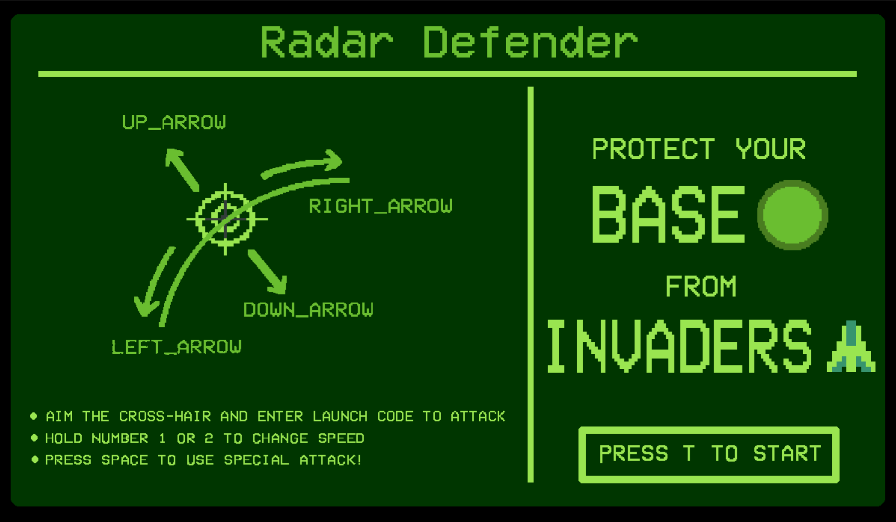
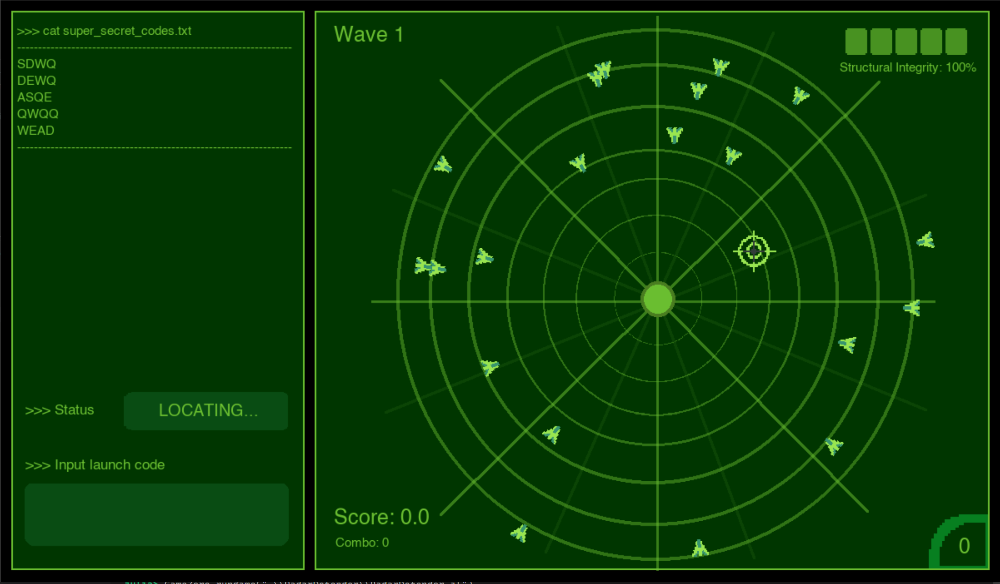

# RadarDefender

RadarDefender is a simple game made using [GameZero.jl](https://github.com/aviks/GameZero.jl) as an entry for the GameJam held in the [Humans of Julia, Discord server](https://discord.com/channels/762167454973296644/775962287461629952). The art and sound effects were made using [Aseprite](https://www.aseprite.org/) and [jsfxr](https://sfxr.me/), respectively. 

A demo video of the gameplay can be seen [here](https://youtu.be/jhMcW-pPb0k).

## Requirements
- GameZero.jl
- Colors.jl

To launch the game, open the Julia REPL from the root directory and run:
`using GameZero; GameZero.rungame(".\\src\\RadarDefender.jl")`

## Objective

Defend your base against the endless horde of invaders.

## Controls
- UP/DOWN to move the cross-hair radially. LEFT/RIGHT to move it along a circular arc.
- TYPE the letters and press ENTER to submit the launch code and attack an invader.
- HOLD 1 to slow down speed (for precise motion) and 2 to speed up.
- Everytime you reach a COMBO of 5 hits, you gain a force-field ability (bottom right) that can wipe out the entire grid, using SPACE key.

## Intended gameplay
- The launch codes only use the letters 'QWEASD', so ideally you place the left hand over those keys, and the right over the arrow keys to play the game. Admittedly, this is centered around the QWERTY layout; if you'd like to change the launch code generation, edit the list in lines `181`, `259`, `274` and `458` (Sorry! I haven't had the time to make the code modular.)

# Known Bugs
- The `schedule_once()` functions from GameZero.jl is used to introduce delays in animations like the force-field ability, or wave progression. This seems buggy and sometimes gets stuck midway. I have no other workaround than to restart the game and hope it doesn't happen again.
- Hitboxes don't match the visuals; this was intentional to keep the game easy.

# Remarks
- I got this idea for the game on the morning of 4th June 2022, with the deadline for the GameJam being 5th June 2022. So, the result is a ton of spagetti code thats unorganized, redundant and extremely messy. I might try to clean it up after the GameJam judging ends, to serve as an example game for GameZero.jl. 
